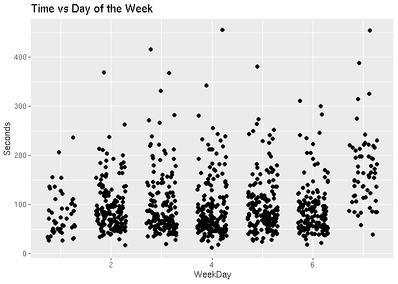
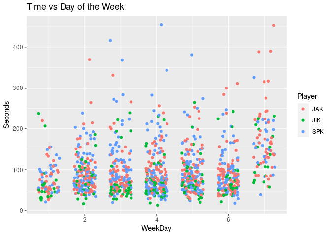
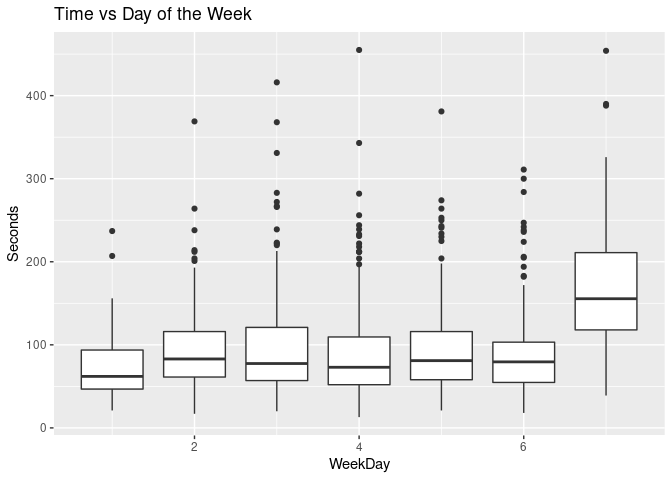
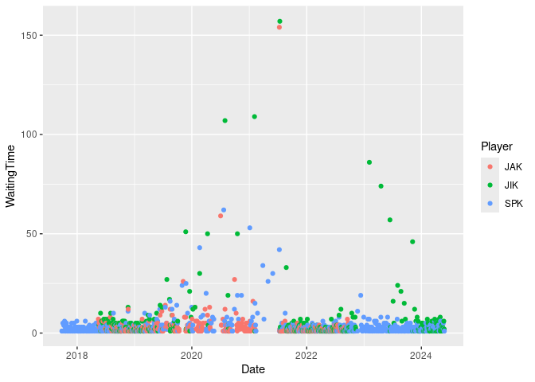
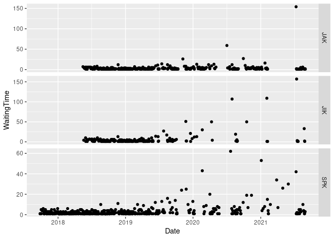
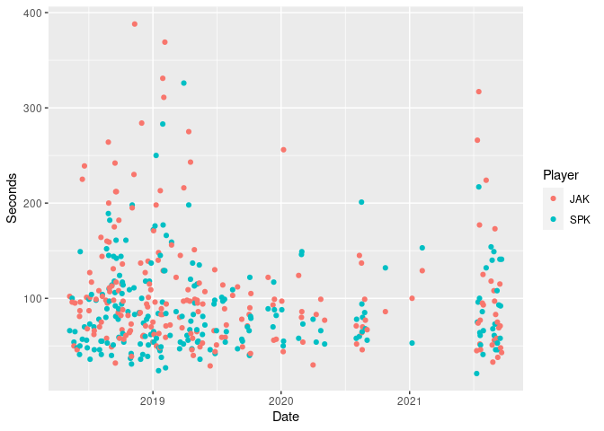

## The Puzzle

Everyday the New York Times puts out a mini crossword.
A group of us have been recording our time to complete the puzzle everytime
we complete a puzzle.
Along with the date and time we also record the time of day that we did the
puzzle.

This is an analysis of that puzzle data.
We look at puzzle completion time across the various players,
across day of the week (are the puzzles harder later in the week?)
and time of day.
This is also an example data analysis done with R in a reproducible manner.
As an example document for learning about R,
all of the R code is shown.

## Setup

We explicitly install the required R packages from CRAN if they
are not already available.


```r
if(!requireNamespace("dplyr", quietly=TRUE)) {
  install.packages("dplyr")
}
if(!requireNamespace("tidyr", quietly=TRUE)) {
  install.packages("tidyr")
}
if(!requireNamespace("ggplot2", quietly=TRUE)) {
  install.packages("ggplot2")
}
if(!requireNamespace("lubridate", quietly=TRUE)) {
  install.packages("lubridate")
}
if(!requireNamespace("hms", quietly=TRUE)) {
  install.packages("hms")
}
if(!requireNamespace("here", quietly=TRUE)) {
  install.packages("here")
}
if(!requireNamespace("assertr", quietly=TRUE)) {
  install.packages("assertr")
}
library("assertr", quietly = TRUE, warn.conflicts = FALSE)
library("tidyr", quietly = TRUE, warn.conflicts = FALSE)
library("dplyr", quietly = TRUE, warn.conflicts = FALSE)
library("ggplot2", quietly = TRUE, warn.conflicts = FALSE)
```
  
## The Data

The `here` package allows us to find files (in this case the raw data file)
anywhere within the project tree.


```r
d <- read.csv(here::here("data", "nyt.csv"), stringsAsFactors=FALSE)
```

The `Date` and `TimeOfDay` are combined and converted to a `POSIX` variable `DateTime`.
The `WeekDay` is then computed from `DateTime`.
The puzzle time (`Time`) was recorded as minutes:seconds,
we convert that to a numeric `Seconds` variable.

```r
d$Date <- as.Date(d$Date)
d$DateTime <- as.POSIXct(with(d,
  paste(Date, ifelse(is.na(TimeOfDay), "00:00", TimeOfDay))))
d$WeekDay <- lubridate::wday(d$DateTime)
d$TimeOfDayOrig <- d$TimeOfDay
d$TimeOfDay <- hms::parse_hm(d$TimeOfDay)
d$Seconds <- with(d, as.numeric(lubridate::seconds(lubridate::ms(Time))))
```

Compute the time interval, in days, between puzzle playing by `Player`.

```r
d <- d %>%
  group_by(Player) %>%
  arrange(Date) %>%
  mutate(WaitingTime = as.numeric(Date - lag(Date), units="days")) %>%
  ungroup()
```

### Data Quality Check

New data is regularly added to the CSV data file.
In this section we do a quality check on the data to make sure no
data entry errors have occurred.

First, set some values that are expected in the data:


```r
# Current list of players:
players <- c("SPK", "JAK", "JIK", "BBK", "SKK", "AKK")
# Earliest date:
first_date <- as.Date("2017-09-25")
# Upper bound on time (10 minutes = 600 seconds):
time_bound <- 600
```

Check that Player is one of 5 possible values:

```r
d %>% assert(in_set(players), Player) %>% success_logical()
```

```
## [1] TRUE
```

There should be no missing values in the data:

```r
d %>% assert(not_na, DateTime, WeekDay, Seconds) %>% success_logical()
```

```
## [1] TRUE
```

Only one observation per player per date:

```r
d %>% group_by(Date) %>% count(Player) %>% verify(n == 1) %>% success_logical()
```

```
## [1] TRUE
```

Check for proper time values:

```r
d %>% assertr::verify(Seconds > 0 & Seconds < time_bound) %>% success_logical()
```

```
## [1] TRUE
```

Check range of dates

```r
first_date <- as.Date("2017-09-25")
today <- Sys.Date()
d %>% 
  assertr::verify(Date >= first_date & Date <= today) %>% success_logical()
```

```
## [1] TRUE
```

## Summary Statistics

Current data set has 1003 observations.


```r
d %>% group_by(Player) %>%
  summarise(Mean = mean(Seconds), Median = median(Seconds), Min = min(Seconds), Max = max(Seconds), N=n()) %>%
  arrange(Median)
```

```
## `summarise()` ungrouping output (override with `.groups` argument)
```

```
## # A tibble: 6 x 6
##   Player  Mean Median   Min   Max     N
##   <chr>  <dbl>  <dbl> <dbl> <dbl> <int>
## 1 SKK     51       47    21    89     4
## 2 AKK     55       55    55    55     1
## 3 JIK     82.5     62    13   264   188
## 4 JAK    103.      87    27   454   339
## 5 SPK    106.      87    18   455   417
## 6 BBK    117.     102    42   350    54
```

## Subset the Data

Subset the data by only working with observations from
`SPK`, `JAK` and `JIK`.
Other players do not have enough observations to analyze.


```r
d <- d %>%
  filter(Player %in% c("SPK", "JAK", "JIK"))
```

Now have 944 observations.

## Plots

An Initial plot of the data.


```r
d %>%
  ggplot(aes(x=WeekDay, y=Seconds)) +
    geom_jitter(position = position_jitter(width=.3)) +
    ggtitle("Time vs Day of the Week")
```

<!-- -->

Same plot with player identified.


```r
d %>%
  ggplot(aes(x=WeekDay, y=Seconds, color=Player)) +
    geom_jitter(position = position_jitter(width=.3)) +
    ggtitle("Time vs Day of the Week")
```

<!-- -->

The distribution of the times, summarised in a boxplot:

<!-- -->

## Days Between Puzzles


```r
d %>%
  ggplot(aes(x=Date, y=WaitingTime, color=Player)) +
    geom_point()
```

```
## Warning: Removed 3 rows containing missing values (geom_point).
```

<!-- -->


```r
d %>%
  ggplot(aes(x=Date, y=WaitingTime)) +
    geom_point() +
    facet_grid(Player ~ ., scales="free")
```

```
## Warning: Removed 3 rows containing missing values (geom_point).
```

<!-- -->

## Player vs Player

```r
# spkjak -----
spkjak <- function(x) {
  m <- match(c("SPK","JAK"), x, nomatch=-1)
  if(all(m > 0)) {
      "SPKJAK"
  } else {
      NA
  }
}
d2 <- group_by(d, Date) %>%
  mutate(SPKJAK = spkjak(Player)) %>%
  ungroup() %>%
  filter(SPKJAK == "SPKJAK")
```

```r
d2 %>% filter(Player %in% c("SPK", "JAK")) %>%
  ggplot(aes(x=Date, y=Seconds, color=Player)) + geom_point()
```

<!-- -->

```r
d3 <- d2 %>% select(Date, Player, Seconds) %>%
  group_by(Date) %>%
  spread(key=Player, value=Seconds) %>%
  ungroup()
```

## Appendix
Knowing the versions of R and the packages used in an analysis is
an important part of reproducibility.
The `sessionInfo` function will show this.

```r
sessionInfo()
```

```
## R version 4.0.3 (2020-10-10)
## Platform: x86_64-pc-linux-gnu (64-bit)
## Running under: Ubuntu 20.04.1 LTS
## 
## Matrix products: default
## BLAS:   /home/R/R-4.0.3/lib/R/lib/libRblas.so
## LAPACK: /home/R/R-4.0.3/lib/R/lib/libRlapack.so
## 
## locale:
##  [1] LC_CTYPE=en_US.UTF-8       LC_NUMERIC=C              
##  [3] LC_TIME=en_US.UTF-8        LC_COLLATE=en_US.UTF-8    
##  [5] LC_MONETARY=en_US.UTF-8    LC_MESSAGES=en_US.UTF-8   
##  [7] LC_PAPER=en_US.UTF-8       LC_NAME=C                 
##  [9] LC_ADDRESS=C               LC_TELEPHONE=C            
## [11] LC_MEASUREMENT=en_US.UTF-8 LC_IDENTIFICATION=C       
## 
## attached base packages:
## [1] stats     graphics  grDevices utils     datasets  methods   base     
## 
## other attached packages:
## [1] ggplot2_3.3.2 dplyr_1.0.2   tidyr_1.1.2   assertr_2.7  
## 
## loaded via a namespace (and not attached):
##  [1] Rcpp_1.0.5        pillar_1.4.7      compiler_4.0.3    tools_4.0.3      
##  [5] digest_0.6.27     lubridate_1.7.9.2 evaluate_0.14     lifecycle_0.2.0  
##  [9] tibble_3.0.4      gtable_0.3.0      pkgconfig_2.0.3   rlang_0.4.9      
## [13] cli_2.2.0         yaml_2.2.1        xfun_0.19         withr_2.3.0      
## [17] stringr_1.4.0     knitr_1.30        generics_0.1.0    vctrs_0.3.6      
## [21] hms_0.5.3         rprojroot_2.0.2   grid_4.0.3        tidyselect_1.1.0 
## [25] glue_1.4.2        here_1.0.1        R6_2.5.0          fansi_0.4.1      
## [29] rmarkdown_2.6     farver_2.0.3      purrr_0.3.4       magrittr_2.0.1   
## [33] scales_1.1.1      ellipsis_0.3.1    htmltools_0.5.0   assertthat_0.2.1 
## [37] colorspace_2.0-0  labeling_0.4.2    utf8_1.1.4        stringi_1.5.3    
## [41] munsell_0.5.0     crayon_1.3.4
```
